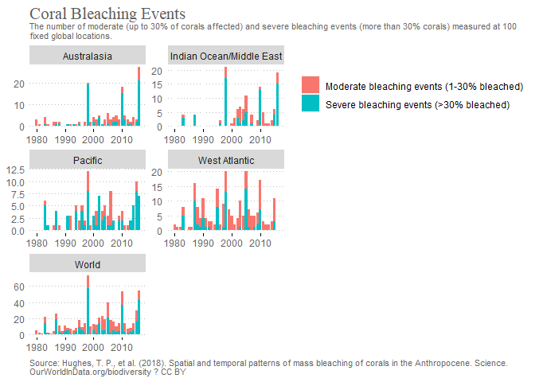

Case Study #2

Upload the tidyerse package.

```r
library(tidyverse)
```

```
## ── Attaching packages ─────────────────────────────────────── tidyverse 1.3.2 ──
## ✔ ggplot2 3.3.6      ✔ purrr   0.3.4 
## ✔ tibble  3.1.8      ✔ dplyr   1.0.10
## ✔ tidyr   1.2.1      ✔ stringr 1.4.1 
## ✔ readr   2.1.2      ✔ forcats 0.5.2 
## ── Conflicts ────────────────────────────────────────── tidyverse_conflicts() ──
## ✖ dplyr::filter() masks stats::filter()
## ✖ dplyr::lag()    masks stats::lag()
```

Bring in our data and look at it.

```r
urlfile="https://github.com/WJC-Data-Science/DTS350/raw/master/coral.csv"
mydata <- read_csv(url(urlfile))
```

```
## Rows: 370 Columns: 5
## ── Column specification ────────────────────────────────────────────────────────
## Delimiter: ","
## chr (3): Entity, Code, Event
## dbl (2): Year, Value
## 
## ℹ Use `spec()` to retrieve the full column specification for this data.
## ℹ Specify the column types or set `show_col_types = FALSE` to quiet this message.
```

```r
#lets see what it looks like.
head(mydata)
```

```
## # A tibble: 6 × 5
##   Entity      Code   Year Event                                      Value
##   <chr>       <chr> <dbl> <chr>                                      <dbl>
## 1 Australasia <NA>   1980 Moderate bleaching events (1-30% bleached)     3
## 2 Australasia <NA>   1980 Severe bleaching events (>30% bleached)        0
## 3 Australasia <NA>   1981 Moderate bleaching events (1-30% bleached)     1
## 4 Australasia <NA>   1981 Severe bleaching events (>30% bleached)        0
## 5 Australasia <NA>   1982 Moderate bleaching events (1-30% bleached)     0
## 6 Australasia <NA>   1982 Severe bleaching events (>30% bleached)        0
```

```r
tail(mydata)
```

```
## # A tibble: 6 × 5
##   Entity Code      Year Event                                      Value
##   <chr>  <chr>    <dbl> <chr>                                      <dbl>
## 1 World  OWID_WRL  2014 Moderate bleaching events (1-30% bleached)     9
## 2 World  OWID_WRL  2014 Severe bleaching events (>30% bleached)        5
## 3 World  OWID_WRL  2015 Moderate bleaching events (1-30% bleached)    14
## 4 World  OWID_WRL  2015 Severe bleaching events (>30% bleached)       16
## 5 World  OWID_WRL  2016 Moderate bleaching events (1-30% bleached)    11
## 6 World  OWID_WRL  2016 Severe bleaching events (>30% bleached)       43
```

```r
str(mydata)
```

```
## spec_tbl_df [370 × 5] (S3: spec_tbl_df/tbl_df/tbl/data.frame)
##  $ Entity: chr [1:370] "Australasia" "Australasia" "Australasia" "Australasia" ...
##  $ Code  : chr [1:370] NA NA NA NA ...
##  $ Year  : num [1:370] 1980 1980 1981 1981 1982 ...
##  $ Event : chr [1:370] "Moderate bleaching events (1-30% bleached)" "Severe bleaching events (>30% bleached)" "Moderate bleaching events (1-30% bleached)" "Severe bleaching events (>30% bleached)" ...
##  $ Value : num [1:370] 3 0 1 0 0 0 3 1 1 0 ...
##  - attr(*, "spec")=
##   .. cols(
##   ..   Entity = col_character(),
##   ..   Code = col_character(),
##   ..   Year = col_double(),
##   ..   Event = col_character(),
##   ..   Value = col_double()
##   .. )
##  - attr(*, "problems")=<externalptr>
```

```r
dim(mydata)
```

```
## [1] 370   5
```

Create a Graph that shows what coral bleaching has done over time. 

```r
ggplot(data = mydata, aes(x = Year, y = Value, fill = Event)) +
  facet_wrap(~Entity, nrow = 3, scales = "free") +
  geom_col() +
  labs(title = "Coral Bleaching Events", 
       subtitle = "The number of moderate (up to 30% of corals affected) and severe bleaching events (more than 30% corals) measured at 100 \nfixed global locations.", 
       caption = "Source: Hughes, T. P., et al. (2018). Spatial and temporal patterns of mass bleaching of corals in the Anthropocene. Science. \nOurWorldInData.org/biodiversity ? CC BY") +
  theme(legend.title = element_blank(), legend.justification = c(0, 1), 
        axis.title.x = element_blank(),
        axis.title.y = element_blank(),
        plot.caption = element_text(hjust = 0, size = 8, color = 'gray40'),
        plot.title = element_text(size = 16, family = 'serif', color = "grey37", margin = margin(t = 1)),
        plot.subtitle = element_text(size = 8, color = "grey40"), 
        axis.ticks.x = element_line(color = "black"),
        axis.ticks.y = element_line(color = "white"),
        axis.text.y = element_text(color = "grey 40"),
        axis.text.x = element_text(color = "grey40"),
        panel.background = element_rect(fill = "white"),
        panel.grid.major.y = element_line(color = "gray", linetype = "dotted"))
```

<!-- -->

In this visulaization you can see all the locations of the number of accidents per year that occurd in those locations. As we can see that in the west atlantic we see the most amount of bleaching. based on the data we see a slight increase of the bleaching as time goes on but noting that shows a trend saying it becoming "more of a problem" than it was. 
