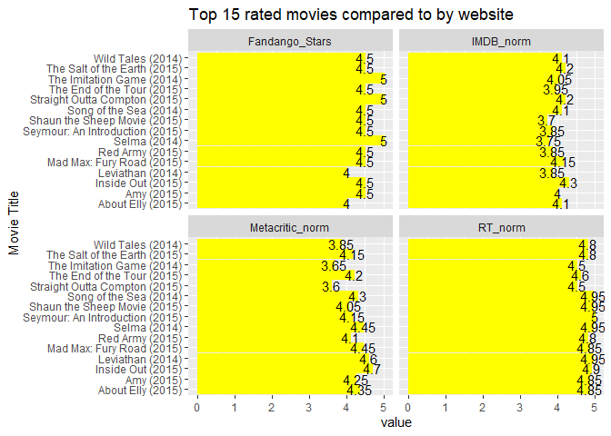
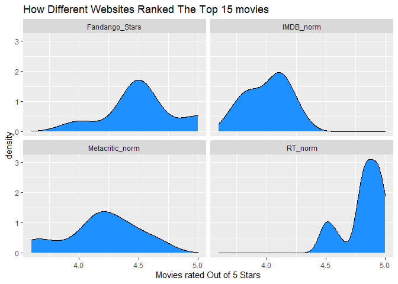

### Task 11
Tiddy up the data so you can create a visualization on how online movie ratings websites compare.


```r
#Load in our packages and our data
library(tidyverse)
```

```
## ── Attaching packages ─────────────────────────────────────── tidyverse 1.3.2 ──
## ✔ ggplot2 3.3.6      ✔ purrr   0.3.4 
## ✔ tibble  3.1.8      ✔ dplyr   1.0.10
## ✔ tidyr   1.2.1      ✔ stringr 1.4.1 
## ✔ readr   2.1.2      ✔ forcats 0.5.2 
## ── Conflicts ────────────────────────────────────────── tidyverse_conflicts() ──
## ✖ dplyr::filter() masks stats::filter()
## ✖ dplyr::lag()    masks stats::lag()
```

```r
#Temp file was having issues so I saved it to my computer then loaded it in. Make sure it was read in corretly.
fandango <- read_csv("fandango_Score_comparison.csv")
```

```
## Rows: 146 Columns: 22
## ── Column specification ────────────────────────────────────────────────────────
## Delimiter: ","
## chr  (1): FILM
## dbl (21): RottenTomatoes, RottenTomatoes_User, Metacritic, Metacritic_User, ...
## 
## ℹ Use `spec()` to retrieve the full column specification for this data.
## ℹ Specify the column types or set `show_col_types = FALSE` to quiet this message.
```

```r
head(fandango)
str(fandango)
```

## Strating to tiddy.
Lets get only what we need from the data set. So we only need the rating from the 4 Websites.

```
## # A tibble: 6 × 5
##   FILM                           Fandango_Stars RT_norm Metacritic_norm IMDB_n…¹
##   <chr>                                   <dbl>   <dbl>           <dbl>    <dbl>
## 1 Avengers: Age of Ultron (2015)            5      3.7             3.3      3.9 
## 2 Cinderella (2015)                         5      4.25            3.35     3.55
## 3 Ant-Man (2015)                            5      4               3.2      3.9 
## 4 Do You Believe? (2015)                    5      0.9             1.1      2.7 
## 5 Hot Tub Time Machine 2 (2015)             3.5    0.7             1.45     2.55
## 6 The Water Diviner (2015)                  4.5    3.15            2.5      3.6 
## # … with abbreviated variable name ¹​IMDB_norm
```

## Arrange and Pivoting
We are pivoting our table so we can get our top 15 overall rated movies from the websites.

```
## # A tibble: 240 × 4
##    FILM                      Ranking Website         value
##    <chr>                       <dbl> <chr>           <dbl>
##  1 Inside Out (2015)            18.4 Fandango_Stars   4.5 
##  2 Inside Out (2015)            18.4 RT_norm          4.9 
##  3 Inside Out (2015)            18.4 Metacritic_norm  4.7 
##  4 Inside Out (2015)            18.4 IMDB_norm        4.3 
##  5 Selma (2014)                 18.2 Fandango_Stars   5   
##  6 Selma (2014)                 18.2 RT_norm          4.95
##  7 Selma (2014)                 18.2 Metacritic_norm  4.45
##  8 Selma (2014)                 18.2 IMDB_norm        3.75
##  9 Mad Max: Fury Road (2015)    18.0 Fandango_Stars   4.5 
## 10 Mad Max: Fury Road (2015)    18.0 RT_norm          4.85
## # … with 230 more rows
```

```
## # A tibble: 6 × 4
##   FILM              Ranking Website         value
##   <chr>               <dbl> <chr>           <dbl>
## 1 Inside Out (2015)    18.4 Fandango_Stars   4.5 
## 2 Inside Out (2015)    18.4 RT_norm          4.9 
## 3 Inside Out (2015)    18.4 Metacritic_norm  4.7 
## 4 Inside Out (2015)    18.4 IMDB_norm        4.3 
## 5 Selma (2014)         18.2 Fandango_Stars   5   
## 6 Selma (2014)         18.2 RT_norm          4.95
```

## Graphing the top rated movies 
<!-- -->

## Density Plot 
The issues with the  Graph above is its hard to compare how each movie compared per websites. So we are going to use a density plot compareing the rating each website gave for those top 15 movies.This should allow us to see if a one websites rated them lower or higher than another. 
<!-- -->

## How they Compare?
From this we can see that Rotten tomotoes on average had higher rating for there top 15 movies compared to the other three. The others were normally distributed for the most part having the ratings being more spread, from what I can see Metacritic seemed to be the most harsh or critical on there rating.
